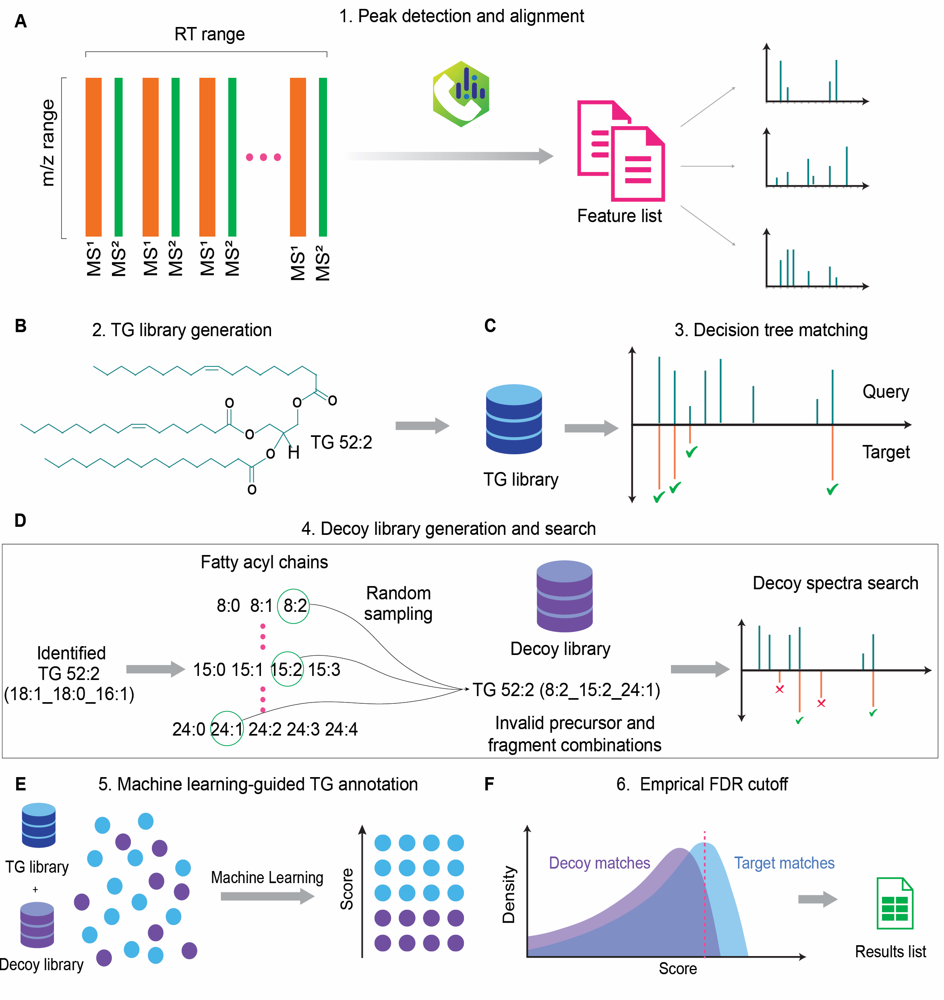

# DIATAGeR v1.0: Triacylglycerol Annotation of Data-Independent Acquisition based Lipidomics

## Introduction 
Triacylglycerols (TGs) are the most abundant lipids in the human body and the primary source of energy storage. Altered TGs are implicated in metabolic syndrome and detailed structural information may provide novel insights into diseases pathology. TGs are comprised of three fatty acyls with various lengths and double bond composition, complicating structural annotation. DIA-based lipidomics enables a continuous and unbiased acquisition of all TGs, creating the potential for more comprehensive TG analysis. However, DIA generates multiplexed tandem mass spectra (MS2) that pose challenges to identifying TGs. Here, we present `DIATAGeR`, an R package aimed to automate and improve TG identification to the molecular species level in DIA-based lipidomics. 

**Instructions on how to use the package described below or available [here](https://velenosi-lab.github.io/DIATAGeR/Vignettes-DIATAGeR.html)**

## DIATAGeR Workflow
<p align="center">
  
</p>

# Required Data 
DIATAGeR requires two data inputs: a feature list and MS2 spectra. Feature list can be an MS-DIAL alignment file or generic format [[feature list example]](https://shorturl.at/COesX). MS2 spectra can be in txt, msp and mgf format (exported from MSDIAL) or mgf format (exported from MZMine). 

# Installation

```R
#Install DIATAGeR
devtools::install_github("Velenosi-Lab/DIATAGeR",
                         build = TRUE, build_vignettes = TRUE, build_manual = T)
```

# DIATAGeR 

## Set-up

```R
# load DIATAGeR library
library(DIATAGeR)

# Set the working directory
setwd("Working directory folder")
```

## Lipid identification

DIATAGeR includes 6 functions: measureFileImport, SpectraImport, RemoveIsotopes, LipidIdentifier, ScoreLipids and FDRCutoff. For further details, please use `help('name of the function', package = "DIATAGeR")`

### Step 1: measureFileImport Function: Feature list Import

measureFileImport reads in the feature list (MSDIAL Alignment file or Generic Format).

#### Example:
```R
# Set the processing parameters
filename <- " .txt"
IonMode <- c("Pos","Neg")
ResultsFiletype = c("MSDIAL","Generic")

# Example

DIA_Pos <-measureFileImport(
  filename = "Feature_List_Liver_MSDIAL.txt",
  IonMode = "Pos",
  ResultsFiletype = "MSDIAL")
```

### Step 2: SpectraImport function: MS2 spectra import to feature list 

#### Example:
```R
# Set the processing parameters
DIADataObj = DIA_Pos # the object stores feature list
fileORfoldername #path to the folder that stores centroid MS2 spectra
ion.mode <- c("Pos","Neg")
results.file.type = c("MSDIAL", "Generic")
spectra.file.type =c("txt","msp","mgf","mgf_mzmine")
rttol #retention time tolerance in seconds. Default to 2
ppmtol # ppm tolerance. Default to 5. This parameter is for generic feature list


# Example
DIA_Pos <- SpectraImport(DIADataObj = DIA_Pos,
                         fileORfoldername =  "Data/Spectra_txt_Liver_MSDIAL",
                         ion.mode = "Pos", 
                         spectra.file.type ="txt",
                         results.file.type = "MSDIAL",
                         rttol = 10)

```

Any features with missing spectra are stored in a folder named "Troubleshooting". 

### Step 3: RemoveIsotopes function: Deisotoping and denosing MS2 spectra

#### Example:

```R
# Set the processing parameters

DIADataObj = DIA_Pos # the object stores feature list
ppmtol #ppm tolerance
low.intensity.cutoff # Any peaks with intensity below this value will be removed. Default 100.
density.cutoff = c(TRUE,FALSE) #If TRUE, a density-based cutoff will be applied.
density.cutoff.value # Default 1. Change with caution. 

#Example
DIA_Pos <- RemoveIsotopes(DIADataObj = DIA_Pos, 
                        ppmtol = 15, 
                        low.intensity.cutoff=100, 
                        density.cutoff=T, 
                        density.cutoff.value=1)
```

### Step 4: LipidIdentifier function: TG identification 

```R
# Set the processing parameters
DIADataObj = DIA_Pos 
lipid = "TAG" #DIATAGeR is for triacylglycerols only. 
ion.mode = c("Pos","Neg")
format = c("MSDIAL","Generic")
ppmtol #ppm tolerance. Default to 15
rttol #retention time tolerance in seconds. Default to 5
intensity.window # Defaults to 0 and infinity. 
version # To specify the version of generated result file.
ms1.precursors #Number of precursors found in MS1 to identify compounds. Default to 1 
ms2.precursors #Number of precursors found in MS2 to identify compounds. 
which.frag = c("any","firsttwo") #specifying whether any fragment should be used or only the first two fragments for identification. Default 'any'.
max.tails # list of desired number of carbons and the maximum number of double 
# bonds for each fatty acyls. 
# Default = "8.2, 9.0, 10.2, 11.0, 12.3, 13.1, 14.3, 15.3, 16.5, 17.3, 
# 18.5, 19.5, 20.6, 21.5, 22.6, 23.0, 24.4, 25.0, 26.0"
exact.tails # library can be customizable for specific tails. Default NULL.
Eg: exact_tails = c("18.1","18.2) creates library of TGs made up 18:1 and 18:2 fatty acids)
print.spectra = c(TRUE,FALSE) # If TRUE, prints MS/MS spectra and mirrored 
# reference peaks. Default FALSE. 
write.annotations = c(TRUE, FALSE) # If TRUE, the function automatically writes 
# RDS file of identified lipids. Default TRUE. 

#Example: 

LipidIdentifier(DIADataObj = DIA_Pos,
                lipid = "TAG", 
                ion.mode = "Pos", 
                format = "MSDIAL",
                ppmtol=15, rttol=5, 
                intensity.window = c(0,Inf),
                version = "September2024", 
                ms1.precursors= 1, ms2.precursors = 1,
                max.tails = "8.2, 9.0, 10.2, 11.0, 12.3, 13.1, 14.3, 15.3, 16.5, 17.3, 18.5, 19.5, 20.6, 21.5, 22.6, 23.0, 24.4, 25.0, 26.0",
                exact.tails = NULL,
                which.frag = "any", 
                print.spectra = F,
                write.annotations = T)
```

A folder named according to ion.mode (Pos/Neg) will be created in the working directory and contain the result file (Eg: Identified_TAG_Pos_September2024_1). This file will contain TGs identified from target database.

### Step 5: ScoreLipids function: TG scoring 

A separate TG identification is performed with the decoy database, then the targeted and decoy annotations are merged and  scored using the machine learning algorithm. 

```R
# Set the processing parameters
DIADataObj = DIA_Pos #The object stores alignment file and spectra
format # Same as LipidIdentifier 
ion.mode # Same as LipidIdentifier 
lipid # Same as LipidIdentifier 
version # Same as LipidIdentifier 
ppmtol # Same as LipidIdentifier 
rttol # Same as LipidIdentifier 
ms1.precursor # Same as LipidIdentifier 
ms2.precursors # Same as LipidIdentifier 
max.tails # Same as LipidIdentifier 
exact.tails # Same as LipidIdentifier 
spectra.file #File path for retrieving spectra from all samples. 
spectra.file.type = c("txt","msp","mgf","mgf_mzmine")

#Example: 

ResultsTG<- ScoreLipids(DIADataObj = DIA_Pos,
                        format = "MSDIAL",
                        lipid = "TAG", 
                        ion.mode = "Pos",
                        version = "September2024", 
                        ppmtol= 15, 
                        rttol = 5, 
                        ms1.precursors =1, ms2.precursors =1, 
                        spectra.file.type ="txt",
                        max.tails = "8.2, 9.0, 10.2, 11.0, 12.3, 13.1, 14.3, 15.3, 16.5, 17.3, 18.5, 19.5, 20.6, 21.5, 22.6, 23.0, 24.4, 25.0, 26.0",
                        exact.tails=NULL,
                        spectra.file = "Data/Spectra_txt_Liver_MSDIAL")

saveRDS(ResultsTG, file = "ResultsTG.RDS")

```


### Step 6: FDRCutoff function: Generating a list of TGs passed through a pre-determined FDR 

The average number of species, molecular species and AUC values after multiple iterations are reported. The function outputs the file containing the highest number of molecular species. If a list of standard TGs is provided, the number of standards found and FDR required to find all standards are reported.

```R
# Set the processing parameters
identified.lipids # List of combined TG annotations 
standard.file # list of standard TGs (Optional)
iteration # #Default 10
cutoff  # Empirical FDR. Default 0.1
rttol #rt tolerance between the rt in standard file and in the result. Default 10

#Example: 


ResultsTG_FDR <- FDRCutoff(identified.lipids = ResultsTG,
                            standard.file = "Standards.csv",
                            iteration=10,
                            cutoff = 0.1,
                            rttol=10)

saveRDS(ResultsTG_FDR, file = "ResultsTG_FDR.RDS")

```
