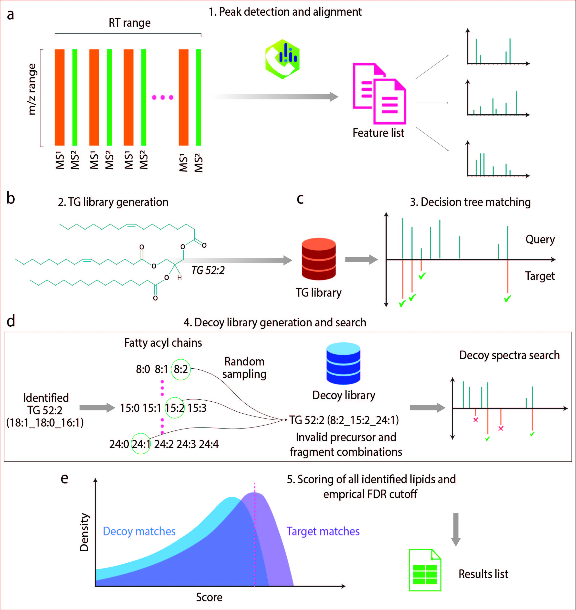

```{r setup, include = FALSE}
knitr::opts_chunk$set(
  collapse = TRUE,
  comment = "#>",
  eval = FALSE
)
```


# Introduction

Triacylglycerols (TGs) are the main component of dietary fat consumption and elevated levels are implicated in dyslipidemia, which contributes to metabolic syndrome. Profiling triacylglycerols (TGs) in biological samples can provide novel insights into metabolic syndrome disease pathology. However, since TGs are comprised of three fatty acyls with various carbon length and double bond combinations, there are potentially thousands of possible molecular species, which are challenging to annotate. This document describes the usage of `DIATAGeR` package to identify TGs acquired by data-independent acquisition (DIA) based liquid chromatography mass spectrometry. 


## DIATAGeR Workflow

{width=100%}
\break

# Required Data 

DIATAGeR requires two data inputs: a feature list and MS2 spectra. Feature list can be MS-DIAL alignment file or generic format <link of feature list example>. MS2 spectra can be in TXT (peak list exported from MSDIAL), MSP and MGF format. 

# Installation

```{r}
#Install DIATAGeR
devtools::install_github("Velenosi-Lab/DIATAGeR",
                         build = TRUE, build_vignettes = TRUE, build_manual = T)

```

# DIATAGeR 

## Set-up

```{r}
# load DIATAGeR library
library(DIATAGeR)

# Example data files can be downloaded from:
# <insert the google drive link>

# Set the working directory
setwd("Working directory folder")
```

## Lipid identification

Six R scripts are used in this package: measureFileImport, SpectraImport, KeepIsotopes, LipidIdentifier, ScoreLipids and FDRCutoff. For further details, please use `help('name of the function, package = "DIATAGeR")`

### Step 1: measureFileImport Function: Feature list Import

measureFileImport reads in feature list (MSDIAL Alignment file or Generic Format). Example of generic format <insert link> 

#### Example:
```{r}
# Set the processing parameters
filename <- " .txt"
IonMode <- c("Pos","Neg")
ResultsFiletype = c("MSDIAL","Generic")

# Example

DIA_Pos <-measureFileImport(
  filename = "Height_0_20239151316.txt",
  IonMode = "Pos",
  ResultsFiletype = "MSDIAL")
```

### Step 2: SpectraImport function: MS2 spectra import to feature list 

#### Example:
```{r}
# Set the processing parameters
DIADataObj = DIA_Pos # the object stores feature list
fileORfoldername #path to the folder that stores centroid MS2 spectra
ion.mode <- c("Pos","Neg")
results.file.type = c("MSDIAL", "Generic")
spectra.file.type =c("txt","msp","mgf")
rttol #retention time tolerance in seconds. Default to 2
ppmtol # ppm tolerance. Default to 5. This parameter is for for generic format


# Example
DIA_Pos <- SpectraImport(DIADataObj = DIA_Pos,
                         fileORfoldername =  "Data/centroid",
                         ion.mode = "Pos", 
                         spectra.file.type ="txt",
                         results.file.type = "MSDIAL",
                         rttol = 10)

```

Any features with missing spectra are stored in a folder named "Troubleshooting". 

### Step 3: RemoveIsotopes function: Deisotoping and denosing MS2 spectra

#### Example:

```{r}
# Set the processing parameters

DIADataObj = DIA_Pos # the object stores feature list
ppmtol #ppm tolerance
low.intensity.cutoff # Anything peaks with intensity below this value will be 
# removed. Default 100.
density.cutoff = c(TRUE,FALSE) #If TRUE, a density-based cutoff will be applied. The kernel
# density estimate of each spectra's intensity distribution will be used to implement
# a low intensity cutoff. 
density.cutoff.value # The low intensity cutoff is the intensity where the
# percentage change in the the Riemann sum of the kernel density when the intensity
# is increased by 10 drops below the density.cutoff.value. Higher value for a lower intensity 
# cutoff. Default 1. Change with caution. 

#Example
DIA_Pos <- KeepIsotopes(DIADataObj = DIA_Pos, 
                        ppmtol = 15, 
                        low.intensity.cutoff=100, 
                        density.cutoff=T, 
                        density.cutoff.value=1)
```

### Step 4: LipidIdentifier function: TG identification 

```{r}
# Set the processing parameters
DIADataObj = DIA_Pos 
lipid = "TAG" #DIATAGeR is for triacylglycerols only. 
ion.mode = c("Pos","Neg")
format = c("MSDIAL","Generic")
ppmtol #ppm tolerance. Default to 15
rttol #retention time tolerance in seconds. Default to 5
intensity.window #Two numerical values, specifying the percentage multiplication
# factor for the precursor intensity that the fragments must fall within. 
# Defaults to 0 and infinity. 
version # Character vector to specify the version of generated result file.
# Appends this character to the output file name. 
ms1.precursors #Number of precursors found in MS1 to identify compounds. Default to 1 
ms2.precursors #Number of precursor found in MS2 to identify compounds. 
which.frag = c("any","firsttwo") #specifying whether any fragment 
# should be used or if the first two fragments should be used for identification. 
# Useful when there are three possible fragments in the reference and only two are 
# required for a positive match. Default 'any'.
max.tails # list of desired number of carbons and the maximum number of double 
#' bonds for each fatty acyl chain length. 
#' Default = "8.2, 9.0, 10.2, 11.0, 12.3, 13.1, 14.3, 15.3, 16.5, 17.3, 
#' 18.5, 19.5, 20.6, 21.5, 22.6, 23.0, 24.4, 25.0, 26.0"
print.spectra = c(TRUE,FALSE) # If TRUE, prints MS/MS spectra and mirrored 
# reference peaks. Default FALSE. 
write.annotations = c(TRUE, FALSE) # If TRUE, the function automatically writes 
# RDS file of identified lipids. Default TRUE. 

#Example: 

LipidIdentifier(DIADataObj = DIA_Pos,
                lipid = "TAG", 
                ion.mode = "Pos", 
                format = "MSDIAL",
                ppmtol=15, rttol=5, 
                intensity.window = c(0,Inf),
                version = "September2024", 
                ms1.precursors= 1, ms2.precursors = 1,
                max.tails = "8.2, 9.0, 10.2, 11.0, 12.3, 13.1, 14.3, 15.3, 16.5, 17.3,
                18.5, 19.5, 20.6, 21.5, 22.6, 23.0, 24.4, 25.0, 26.0",
                which.frag = "any", 
                print.spectra = F,
                write.annotations = T)
```

A folder named according to ion.mode (Pos/Neg) will be created in the working directory and contain the result file (Eg: Identified_TAG_Pos_September2024_1). This file contains TGs identified from target database.

### Step 5: ScoreLipids function: TG scoring 

A separate TG identification is performed with the decoy database, then the targeted and decoy annotations were merged.
This function will create a decoy database which contains decoy TGs. The combined TG annotations were scored using the machine learning algorithm. 

```{r}
# Set the processing parameters
DIADataObj = DIA_Pos #The object stores alignment file and spectra
format # tell the function if the alignment file is MSDIAL or Generic Format
ion.mode #Mass spectrometry ion mode, the same as in LipidIdentifier. 
lipid #Lipid class, the same as in LipidIdentifier. 
version #Version name, the same as in LipidIdentifier. Also used to pull identified lipids from the ion.mode folder. 
ppmtol #PPM tolerance, the same as in LipidIdentifier. Default 15. 
rttol #Retention time tolerance, the same as in LipidIdentifier. Default 5. 
spectra.file #File path for retrieving spectra from all samples. 
ppmtolMS1 #Defaults to ppmtol if not specified. 
ms1.precursors #Number of precursors found in MS1 to identify compounds. Default to 1 
ms2.precursors #Number of precursor found in MS2 to identify compounds. 
spectra.file.type #specify txt, msp or mgf files. The user will have determined the spectra name
max.tails #list of desired number of carbons and the maximum number of double 
#' bonds for each fatty acyl chain length. 
#' Default = "8.2, 9.0, 10.2, 11.0, 12.3, 13.1, 14.3, 15.3, 16.5, 17.3, 18.5

#Example: 

ResultsTG<- ScoreLipids(DIADataObj = DIA_Pos,
                          lipid = "TAG", 
                          ion.mode = "Pos",
                          version = "September2024", 
                          ppmtol= 15, 
                          rttol = 5, 
                          ms1.precursors =1, ms2.precursors =1, 
                          spectra.file.type ="txt",
                          max.tails = "8.2, 9.0, 10.2, 11.0, 12.3, 13.1, 14.3, 15.3, 16.5, 17.3, 
                          18.5, 19.5, 20.6, 21.5, 22.6, 23.0, 24.4, 25.0, 26.0",
                          spectra.file = "Data/Centroid/")

saveRDS(ResultsTG, file = "ResultsTG.RDS")

```


### Step 6: FDRCutoff function: Generating a list of TGs passed through a pre-determined FDR 

The average number of species, molecular species and AUC values after multiple iterations are reported. The function outputs the file containing the highest number of molecular species. If a list of standard TGs is provided, the number of standards found and FDR required to find all standards are reported.

```{r}
# Set the processing parameters
identified.lipids # List of combined TG annotations 
standard.file # list of standard TGs (Optional)
iteration # #Default 10
cutoff  # Empirical FDR. Default 0.1

#Example: 

ResultsTG_FDR <- FDRCutoff(identified.lipids = ResultsTG,
                            standard.file = "Standards.csv",
                            iteration=10,
                            cutoff = 0.1)

saveRDS(ResultsTG_FDR, file = "ResultsTG_FDR.RDS")

```
